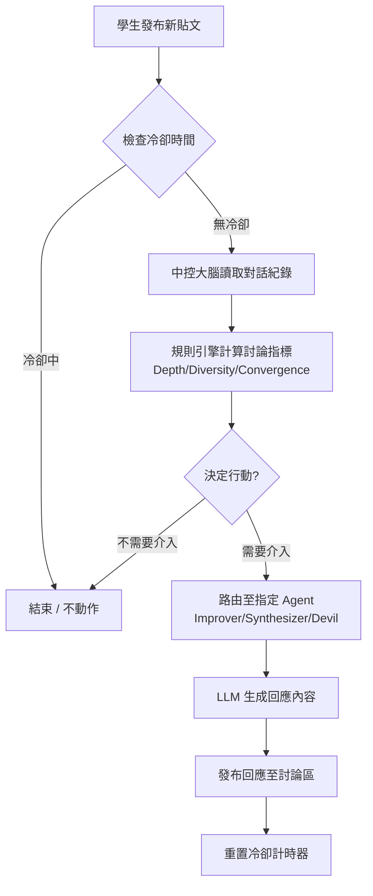

# AI-Scaffold Orchestrator for Knowledge Building

## 專案目標
開發一套基於 LLM 的多重代理人系統 (Multi-Agent System)，能自動監測學生的討論內容，並在「適當的時機」自主選擇扮演「想法改進者」、「綜合者」或「魔鬼代言人」介入討論，以促進高中生的知識翻新。

## 系統架構與詳細功能需求 (Functional Requirements)

系統分為三個層級，對應三個核心模組：

### 模組 A: 監聽與上下文管理 (Context Manager) - Input Layer
-   **輸入**: 接收最近 N 篇貼文 (Sliding Window, 建議 N=10) 或是特定討論串的全部內容。
-   **處理**: 將非結構化文字整理為 JSON 格式（包含：學生ID、時間戳記、內文、引用關係）。

### 模組 B: 中控大腦 (The Orchestrator) - Brain Layer
這是不對外說話的後台 Agent，負責「診斷」與「派單」。
-   **觸發機制**: 每當有新貼文產生時觸發（Event-driven）。
-   **冷卻機制 (Cooldown)**: 為避免洗版，設定全域冷卻時間（例如：同一討論串 AI 介入後需等待 20 分鐘或新增 3 篇貼文後，才允許再次掃描）。
-   **判斷邏輯 (Reasoning Loop)**:
    -   **分析狀態**: 評分目前的討論品質（深度 Depth、多樣性 Diversity、收斂度 Convergence）。
    -   **決策門檻 (Thresholds)**:
        -   `IF (Depth < Low) AND (New_Post_Count > 3)` -> **Trigger: Idea Improver**
        -   `IF (Diversity < Low) AND (Agreement > High)` -> **Trigger: Devil's Advocate**
        -   `IF (Information_Entropy > High) OR (Post_Count > 10 without Summary)` -> **Trigger: Synthesizer**
        -   `ELSE` -> **Action: None** (保持靜默)
-   **輸出**: `Action_Command` (例如：`{"role": "Devil_Advocate", "target_post_ids": [101, 102]}`)

### 模組 C: 執行代理人 (Worker Agents) - Action Layer
根據模組 B 的指令，載入特定 Persona 進行回應生成。

| 角色名稱 | 功能定義 | 語氣設定 (Tone) |
| :--- | :--- | :--- |
| **Idea Improver** | 針對單一或少數觀點，指出邏輯缺口，提出引導式問題。 | 蘇格拉底式、好奇、鼓勵性。 |
| **Synthesizer** | 針對多篇觀點，提取共識與張力，繪製知識地圖。 | 客觀、清晰、結構化、像圖書館員。 |
| **Devil's Advocate** | 針對過度一致的觀點，提出反例或不同視角。 | 禮貌的挑戰者、提供「如果...會怎樣」的情境。 |

---

## 資料流與實作邏輯 (Implementation Logic)

> **⚠️ 技術決策說明**：Orchestrator 使用**規則引擎**而非 LLM 做決策，原因是：
> 1. **延遲**：規則引擎 60ms vs LLM 2000ms
> 2. **成本**：規則引擎 $0 vs LLM $0.001/次
> 3. **可預測性**：規則引擎 100% 確定性輸出，LLM 有隨機性
> 4. **可調參**：規則引擎改數字重啟即可，LLM 需要調 prompt 反覆測試

---

## 開發階段規劃 (Phasing)

### Phase 1: The Manual Trinity (MVP) - ✅ 已完成
**目標**：建立基礎設施，驗證三種 Agent 人格的有效性。不涉及自動判斷，由人工手動觸發。

#### 1. Backend Refactor (`controllers/kbCoach.js`)
-   **Agent Factory**: 建立 `AGENT_PERSONAS`，定義三種人格與 System Prompts。
    -   🛠️ **Idea Improver**: 蘇格拉底式引導。
    -   🔗 **Synthesizer**: 知識整合與連結。
    -   😈 **Devil's Advocate**: 批判性思考挑戰。
-   **Context Manager**: 實作 `SlidingWindowContext` (N=10)，抓取最近貼文作為短期記憶。
-   **Unified Schema**: 統一輸出格式 `{ thinkingProcess, content, suggestedActions }`。

#### 2. Frontend Interface (`components/KB_Coach.jsx`)
-   **UI 重構**: 實作「三按鈕」介面，取代舊版單一按鈕。
-   **CoT 展示**: 新增折疊區塊顯示 AI 的 `thinkingProcess`，促進後設認知。
-   **Markdown 渲染**: 引入 `react-markdown` 優化閱讀體驗。

---

### Phase 2: The Silent Orchestrator (Automation Core) - ✅ 已完成
**目標**：實作「中控大腦」與「冷卻機制」，讓系統具備自主性。

#### 1. The Brain (`services/orchestrator.js`) ✅
-   **Orchestrator Agent**: 背景 Agent，不直接對話，負責診斷與派單。
-   **Reasoning Loop**:
    -   Input: 最近 N 篇貼文 + 討論區元數據 (Depth, Diversity, Convergence)。
    -   Output: JSON 指令 `{ action: "TRIGGER" | "WAIT", role: "...", reason: "..." }`。
-   **決策規則引擎**:
    -   `Depth < 40 AND NodeCount >= 3` -> Trigger Improver
    -   `Diversity <= 40 AND Convergence >= 40` -> Trigger Devil's Advocate
    -   `NodeCount >= 10 AND Convergence < 30` -> Trigger Synthesizer
    -   否則保持靜默 (WAIT)

#### 2. Cooldown Mechanism (`utils/cooldownManager.js`) ✅
-   **State Management**: 記憶體 Map 快取 `LastInterventionTime` + `PostCount`。
-   **冷卻規則**:
    -   時間維度：同一討論串 20 分鐘冷卻。
    -   活動維度：或新增 3 篇貼文後允許再次介入。
-   **記憶體管理**: 
    -   定期清理 24 小時無活動的記錄。
    -   使用 `unref()` 避免阻塞測試進程退出。

#### 3. Discussion Analyzer (`services/discussionAnalyzer.js`) ✅
-   **三大指標計算**:
    -   **Depth (深度)**: 平均內容長度 (調整為中文適用門檻)。
    -   **Diversity (多樣性)**: 獨特作者數量。
    -   **Convergence (收斂度)**: 關鍵詞重複率（簡化版分詞）。
-   **討論分類**: SHALLOW | ECHO_CHAMBER | OVERLOAD | HEALTHY

#### 4. Integration Hook ✅
-   **Event-Driven**: 
    -   HTTP API: `controllers/node.js` - 使用 `setImmediate()` 非同步觸發。
    -   **Socket**: `sockets/handlers/nodeHandler.js` - 前端主要使用此路徑建立節點。
-   **零破壞性**: 
    -   立即回應使用者（HTTP 200 或 Socket Success）。
    -   Orchestrator 失敗不影響發文流程（靜默失敗）。
-   **環境控制**: 可透過 `ORCHESTRATOR_ENABLED=false` 關閉功能。
-   **⚠️ 重要**: 新建節點與延伸節點都會觸發 Orchestrator。

#### 5. Testing & Validation ✅
-   **測試腳本**: `tests/orchestrator.test.js` 涵蓋 4 種討論情境。
-   **所有測試通過**: 
    -   ✅ 淺層討論 -> Improver
    -   ✅ 同溫層 -> Devil's Advocate  
    -   ✅ 資訊過載 -> Synthesizer
    -   ✅ 健康討論 -> 保持靜默
    -   ✅ 冷卻機制驗證
    -   ✅ 空討論邊界處理

#### 6. Debug 監控面板 (`components/OrchestratorMonitor.jsx`) ✅
-   **功能**: 讓開發者在前端即時查看 Orchestrator 的決策結果。
-   **位置**: 想法牆頁面右上角（僅限非觀摩模式）。
-   **顯示內容**:
    -   冷卻狀態（可介入/冷卻中）
    -   討論品質指標（Depth/Diversity/Convergence）
    -   決策結果（TRIGGER/WAIT/COOLDOWN）
    -   建議 Agent 類型
-   **API 端點**:
    -   `GET /api/kb-coach/orchestrator/status/:ideaWallId` - 查詢冷卻狀態
    -   `POST /api/kb-coach/orchestrator/analyze` - 手動觸發分析（Debug 用）

---

### Phase 3: Full Integration (Deployment) - ✅ 已完成
**目標**：前端自動化接入，讓 AI 成為討論區的隱形參與者。

> **⚠️ 設計決策說明**：Phase 3 採用「通知 + 確認」模式，而非「自動插入 AI 節點」。
> 原因：自動插入可能干擾學生思考，應該讓學生主動決定是否採納 AI 建議。

#### 1. Event-Driven Trigger ✅
-   **觸發點**（兩個入口都有 Hook）:
    -   HTTP API: `controllers/node.js` (較少使用)
    -   **Socket**: `sockets/handlers/nodeHandler.js` (前端主要路徑)
-   **觸發時機**: 新建節點 & 延伸節點都會觸發。
-   **Orchestrator Socket 整合** (`orchestrator.js` 新增):
    -   `setSocketIO(io)`: 注入 Socket.io 實例（server.js 啟動時）。
    -   傳入 `{ io }` 選項確保使用正確的 Socket 實例。
-   **房間名稱規則**: 使用 `String(projectId)` 作為房間名（如 `"71"`，非 `"project-71"`）。

#### 2. Frontend Notification ✅
-   **即時通知**: 使用 Socket.io 實現。
    -   後端發送: `aiSuggestion` 事件到專案房間。
    -   前端監聽: `IdeaWall.jsx` 中註冊 Socket 監聽器。
-   **UI 呈現**: 
    -   Toast 通知：「🤖 AI 助教有建議給你！」+ 「查看建議」按鈕。
    -   點擊後開啟 KB Coach Modal，並帶入建議的 Agent 類型。
-   **KB Coach 增強** (`KB_Coach.jsx` 修改):
    -   新增 `suggestedAgent` prop，支援自動觸發指定的 Agent。
    -   若有建議的 Agent，延遲 500ms 後自動開始分析。

#### 3. Feedback Loop ✅
-   **前端 UI**: KB Coach 結果顯示後，下方出現「👍 有幫助」/「👎 需改進」按鈕。
-   **Socket 事件**: 點擊按鈕發送 `aiCoachFeedback` 事件。
-   **資料儲存**: 
    -   新增 `ai_feedback` Model 儲存回饋數據。
    -   資料庫遷移: `migrations/20251126000000-create-ai-feedbacks.js`
    -   Socket Handler 接收並寫入資料庫。
-   **API 端點**:
    -   `POST /api/kb-coach/feedback` - 儲存回饋。
    -   `GET /api/kb-coach/feedback/stats` - 取得統計（供管理者查看）。

---

### Phase 4: 智能學習 - 📅 未來規劃
**目標**：利用 Feedback 數據優化系統。

#### 1. Feedback 分析
-   分析各 Agent 的 helpful/not_helpful 比例。
-   識別哪些情境下哪個 Agent 最有效。

#### 2. 動態調參
-   根據 Feedback 調整決策門檻。
-   A/B Testing 不同的介入策略。

#### 3. LLM 輔助決策
-   若規則引擎的 not_helpful 率 > 30%，考慮引入 LLM 做更細緻的判斷。

---

### Phase 5: 教師儀表板 - 📅 未來規劃
**目標**：提供教師視角的監控與調整介面。

#### 1. 決策歷史視覺化
-   時間軸顯示 Orchestrator 的所有決策。
-   每個決策可展開查看詳細的分析結果。

#### 2. Feedback 趨勢圖
-   各 Agent 的滿意度趨勢。
-   按專案/班級分組統計。

#### 3. 手動調整
-   讓教師可以微調冷卻時間、決策門檻等參數。
-   即時生效，無需重啟服務。

---

## 關鍵技術指標 (Key Technical Specs)

-   **決策引擎**:
    -   **Orchestrator**: 使用**規則引擎** (非 LLM)，基於統計指標做決策。
        -   ✅ 延遲：< 100ms
        -   ✅ 成本：$0
        -   ✅ 可預測性：100%
    -   **未來考量**: 若規則引擎失敗率 > 30%（透過 Feedback Loop 收集），才考慮引入 LLM 輔助決策。
-   **LLM 模型**（僅用於 Worker Agents 生成內容）:
    -   Worker Agents: 使用 `gemini-2.5-flash` 或 `gpt-4o-mini` (高性價比)。
-   **Prompt Engineering**:
    -   必須使用 **Chain-of-Thought (CoT)**，要求 AI 先輸出思考過程再輸出建議。
-   **Latency**:
    -   Orchestrator 決策：< 100ms（規則引擎）
    -   Worker Agent 回應生成：1-3 秒（LLM）
    -   Phase 3 的自動分析必須是非同步 (Async)，不可阻塞使用者發文流程。

---

## Phase 2 新增檔案清單

| 檔案路徑 | 用途 | 移除時機 |
|---------|------|--------|
| `services/orchestrator.js` | 核心決策引擎 | 永久保留 |
| `services/discussionAnalyzer.js` | 討論品質分析 | 永久保留 |
| `utils/cooldownManager.js` | 冷卻機制管理 | 永久保留 |
| `tests/orchestrator.test.js` | 測試腳本 | 視需要保留 |
| `routes/kbCoach.js` (擴充) | 新增 Orchestrator API 端點 | 永久保留 |
| `controllers/node.js` (修改) | 新增 Orchestrator Hook | 永久保留 |
| `components/OrchestratorMonitor.jsx` | Debug 監控面板 | **正式上線後可移除** |
| `HOW_TO_VERIFY_PHASE2.md` | 驗證文件 | 正式上線後可移除 |
| `PHASE_COMPARISON.md` | Phase 差異說明 | 正式上線後可移除 |

---

## Phase 3 新增檔案清單

| 檔案路徑 | 用途 | 移除時機 |
|---------|------|--------|
| `sockets/handlers/aiCoachHandler.js` | AI Coach Socket 事件處理 | 永久保留 |
| `models/ai_feedback.js` | Feedback 資料模型 | 永久保留 |
| `migrations/20251126000000-create-ai-feedbacks.js` | 資料庫遷移檔 | 永久保留 |
| `sockets/socketManager.js` (修改) | 註冊 AI Coach Handler | 永久保留 |
| `sockets/handlers/nodeHandler.js` (修改) | 新增 Orchestrator Hook (Socket 路徑) | 永久保留 |
| `services/orchestrator.js` (修改) | 新增 Socket 通知功能 | 永久保留 |
| `server.js` (修改) | 注入 Socket.io 到 Orchestrator | 永久保留 |
| `controllers/kbCoach.js` (修改) | 新增 Feedback API | 永久保留 |
| `routes/kbCoach.js` (修改) | 新增 Feedback 路由 + io 注入 | 永久保留 |
| `pages/ideaWall/IdeaWall.jsx` (修改) | Socket 監聽 + Toast 通知 | 永久保留 |
| `pages/ideaWall/components/KB_Coach.jsx` (修改) | 建議 Agent + Feedback UI | 永久保留 |
| `docs/HOW_TO_VERIFY_PHASE3.md` | 驗證文件 | 正式上線後可移除 |
