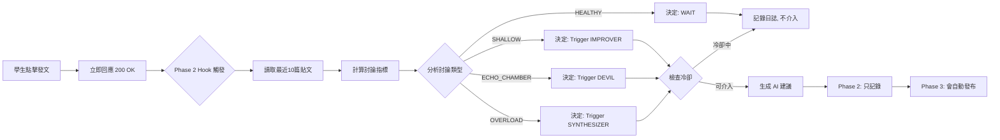

# Phase 1 vs Phase 2 完整對比說明

## 🎯 核心差異一句話總結

**Phase 1**: 你手動按按鈕 -> AI 回應  
**Phase 2**: AI 自動監測 -> 判斷是否需要介入 -> (Phase 3 才會自動回應)

---

## 📊 功能對比表

| 特性 | Phase 1 | Phase 2 | Phase 3 (未來) |
|------|---------|---------|----------------|
| **觸發方式** | 👆 手動點擊 | 🤖 自動監測 | 🤖 自動監測 |
| **決策方式** | 👤 你選擇 Agent | 🧠 AI 自動選擇 | 🧠 AI 自動選擇 |
| **前端可見** | ✅ 立即顯示建議 | ❌ 只有日誌/監控面板 | ✅ 自動通知 + 插入建議 |
| **冷卻機制** | ❌ 無限制 | ✅ 20分鐘或3篇貼文 | ✅ 20分鐘或3篇貼文 |
| **討論品質分析** | ❌ 無 | ✅ Depth/Diversity/Convergence | ✅ 持續改進 |
| **使用體驗** | 主動求助 | 背景監控 | AI 主動介入 |

---

## 🔍 如何在平台上感受 Phase 2？

### **方法 1: 新增的監控面板（右上角）**

我已經新增了 `OrchestratorMonitor` 元件，你現在可以：

1. **前端操作**：
   - 進入任何想法牆頁面
   - 看右上角的「🧠 Phase 2 Orchestrator 監控」面板
   - 點擊「🔍 查看自動分析結果」按鈕

2. **你會看到**：
   ```
   決策: TRIGGER / WAIT / COOLDOWN
   建議 Agent: 🛠️ Idea Improver / 🔗 Synthesizer / 😈 Devil's Advocate
   理由: "淺層討論（深度分數: 30）- 需要引導深化"
   
   討論品質指標:
   - 深度: 30
   - 多樣性: 70
   - 收斂度: 40
   ```

### **方法 2: 查看後端日誌**

每次有人發文，後端 console 會輸出：

```bash
🔔 [Hook] New node created, triggering Orchestrator...
🧠 [Orchestrator] Analyzing ideaWall 5 in project 2...
🧠 [Orchestrator] Decision: TRIGGER - 淺層討論（深度分數: 30）- 需要引導深化
🤖 [Orchestrator] Triggering IMPROVER...
```

### **方法 3: 檢查資料庫審計日誌**

```sql
SELECT 
    action,
    metadata->>'decision' as decision,
    metadata->>'role' as suggested_agent,
    metadata->>'reason' as reason,
    metadata->'analysis' as quality_scores,
    createdAt
FROM audit_events 
WHERE action = 'ORCHESTRATOR_DECISION'
ORDER BY createdAt DESC 
LIMIT 10;
```

---

## 💡 Phase 2 背後運作流程

### **當學生發文時...**



---

## 🎮 實際測試步驟

### **測試 1: 淺層討論（觸發 Improver）**

1. 連續發 4 篇內容很短的貼文：
   ```
   貼文1: "我覺得不錯"
   貼文2: "同意"
   貼文3: "對啊"
   貼文4: "+1"
   ```

2. 點擊監控面板的「查看自動分析結果」

3. **預期結果**：
   - 決策: `TRIGGER`
   - 建議 Agent: `🛠️ Idea Improver`
   - 理由: "淺層討論（深度分數: 20）- 需要引導深化"
   - 深度: **低** (< 40)

### **測試 2: 同溫層（觸發 Devil's Advocate）**

1. 讓 2 個學生反覆討論同一觀點（使用相同關鍵詞）：
   ```
   Alice: "氣候變遷主要是碳排放造成的，我們應該推動綠色能源..."
   Bob: "沒錯，碳排放是關鍵，綠色能源是唯一出路..."
   Alice: "完全同意，綠色能源綠色能源碳排放..."
   ```

2. 查看分析結果

3. **預期結果**：
   - 決策: `TRIGGER`
   - 建議 Agent: `😈 Devil's Advocate`
   - 理由: "同溫層風險（多樣性: 40, 收斂度: 50）- 需要挑戰觀點"
   - 多樣性: **低** (只有 2 人)
   - 收斂度: **高** (關鍵詞重複)

### **測試 3: 資訊過載（觸發 Synthesizer）**

1. 連續發 12 篇討論不同主題的貼文

2. 查看分析結果

3. **預期結果**：
   - 決策: `TRIGGER`
   - 建議 Agent: `🔗 Synthesizer`
   - 理由: "資訊過載（12篇貼文，收斂度: 15）- 需要整合觀點"

### **測試 4: 冷卻機制**

1. 第一次分析後顯示 `TRIGGER`
2. 立即再點一次「查看分析」
3. **預期結果**：
   - 決策: `COOLDOWN`
   - 理由: "仍在冷卻中（剩餘 20 分鐘）"

---

## ⚠️ Phase 2 的限制（為什麼你感覺像 Phase 1）

### **Phase 2 只做了一半工作**

✅ **已完成（後端智能）**：
- 自動監測每次發文
- 自動計算討論品質
- 自動決定是否需要介入
- 冷卻機制避免過度干擾

❌ **未完成（前端呈現）**：
- ❌ 沒有即時通知「AI 正在分析...」
- ❌ 沒有自動顯示 AI 建議
- ❌ 還是要手動點按鈕才能看 AI 回應
- ❌ 沒有讓學生對 AI 建議按讚/倒讚

### **為什麼這樣設計？**

Linus 原則：**分階段驗證**

1. **Phase 1**: 驗證 Agent 人格是否有效
2. **Phase 2**: 驗證自動決策邏輯是否準確
3. **Phase 3**: 整合前端，讓 AI 真正「介入」討論

如果 Phase 2 直接自動發文，但決策邏輯有問題（例如誤判健康討論為淺層討論），會造成嚴重的使用者體驗問題。

**先讓決策邏輯跑一陣子，透過監控面板和日誌調整門檻值，確認準確後再開放自動發文。**

---

## 🚀 Phase 3 預覽（未來會這樣）

### **Phase 3 的完整體驗**：

1. **學生 A** 發了一篇淺層討論
2. 前端立即跳出通知：「🤖 AI 助教正在分析討論品質...」
3. 3 秒後，討論區自動插入一則新訊息：
   ```
   🛠️ AI 想法改進者
   
   我注意到你的想法很有趣，但可以更深入探討：
   1. 你提到「這個不錯」，能具體說明哪個部分最吸引你嗎？
   2. 如果要改進，你會從哪個角度切入？
   
   [👍 有幫助] [👎 沒幫助]
   ```
4. 學生可以直接點讚或回應 AI
5. 系統收集反饋，持續優化決策邏輯

---

## 📝 總結

**你的感受是對的** - Phase 2 在前端看起來跟 Phase 1 差不多，因為：

1. ✅ Phase 2 的核心（自動監測 + 決策引擎）**已經在背景運作**
2. ❌ 但前端呈現方式還是手動觸發（保留 Phase 1 的 UI）
3. 🎯 新增的監控面板讓你能**看到自動分析的結果**
4. 🚀 Phase 3 會讓 AI 建議**自動出現**，才是真正的「自主介入」

**現階段你可以透過監控面板驗證 Phase 2 確實在運作，並觀察決策邏輯是否準確。**
