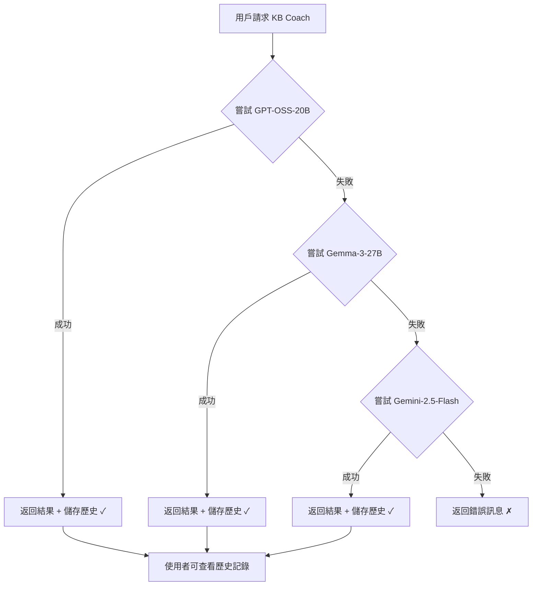

# KB Coach AI 模型 Fallback 機制 + 歷史記錄系統

## 概述

KB Coach 採用三層智能 Fallback 架構，確保服務高可用性，並提供完整的歷史記錄功能讓使用者回顧過往建議。

```
GPT-OSS-20B (Layer 1) 
    ↓ (失敗時)
Gemma-3-27B (Layer 2)
    ↓ (失敗時)
Gemini-2.5-Flash (Layer 3 - 最終保障)
```

## 新功能：歷史記錄系統

### 資料庫設計

**表名**: `kb_coach_histories`

儲存內容：
- AI 完整回應（思考過程、內容、建議行動）
- 使用的模型（GPT-OSS/Gemma/Gemini）
- 關聯資訊（專案、節點、使用者）
- 效能指標（回應時間、上下文數量）

### API 端點

#### 1. 查詢歷史記錄列表
```http
GET /api/kb-coach/history
```

Query Parameters:
- `projectId` - 專案 ID
- `nodeId` - 節點 ID（查詢特定節點的歷史）
- `userId` - 使用者 ID
- `agentType` - Agent 類型 (IMPROVER, SYNTHESIZER, DEVIL)
- `limit` - 返回筆數（預設 20）

Response:
```json
{
  "total": 5,
  "histories": [
    {
      "id": 1,
      "agentType": "IMPROVER",
      "model": "GPT-OSS-20B",
      "nodeTitle": "AI 對教育的影響",
      "nodeContent": "我認為...",
      "thinkingProcess": "...",
      "responseContent": "...",
      "suggestedActions": [...],
      "contextCount": 8,
      "responseTimeMs": 2300,
      "timestamp": "2026-02-06T10:30:00Z"
    }
  ]
}
```

#### 2. 查詢單筆歷史詳情
```http
GET /api/kb-coach/history/:id
```

Response: 完整的歷史記錄詳情

### 前端功能

#### KB_Coach.jsx 組件
- 📜 **歷史記錄按鈕**：點擊查看過往建議
- **歷史列表面板**：顯示最近 10 筆記錄
- **一鍵重現**：點擊歷史項目立即載入該建議
- **視覺化標籤**：不同 Agent 類型用不同顏色標示

使用範例：
1. 開啟 KB Coach
2. 點擊右上角「📜 歷史」按鈕
3. 瀏覽過往的 AI 建議
4. 點擊任一項目即可查看完整內容

## 模型配置

### Layer 1: GPT-OSS-20B (優先)
- **模型**: `openai/gpt-oss-20b`
- **API 端點**: `https://vllm-210.hsueh.tw/v1`
- **環境變數**:
  ```bash
  HSUEH_VLLM_BASE_URL=https://vllm-210.hsueh.tw/v1
  HSUEH_VLLM_MODEL_NAME=openai/gpt-oss-20b
  ```

### Layer 2: Gemma-3-27B
- **模型**: `ISTA-DASLab/gemma-3-27b-it-GPTQ-4b-128g`
- **API 端點**: `https://earth-vllmapi.agenticgrader.com/v1`
- **環境變數**:
  ```bash
  VLLM_BASE_URL=https://earth-vllmapi.agenticgrader.com/v1
  VLLM_MODEL_NAME=ISTA-DASLab/gemma-3-27b-it-GPTQ-4b-128g
  ```

### Layer 3: Gemini-2.5-Flash (終極 Fallback)
- **模型**: `gemini-2.5-flash`
- **API 端點**: Google AI Studio
- **環境變數**:
  ```bash
  GEMINI_API_KEY=your_api_key_here
  ```

## 工作流程



## 部署步驟

### 1. 執行資料庫遷移
```bash
cd sdl-backend-main
npm run migrate
```

這會創建 `kb_coach_histories` 表。

### 2. 重啟後端服務
```bash
npm run dev
```

### 3. 測試歷史記錄功能
```bash
# 查詢歷史記錄
curl http://localhost:3000/api/kb-coach/history?nodeId=1

# 查看單筆詳情
curl http://localhost:3000/api/kb-coach/history/1
```

## 監控與優化

### 追蹤模型使用率
```sql
-- 查看各模型的使用次數
SELECT 
  model_used as model,
  COUNT(*) as usage_count,
  AVG(response_time_ms) as avg_response_time
FROM kb_coach_histories
GROUP BY model_used
ORDER BY usage_count DESC;
```

### 分析 Agent 效能
```sql
-- 查看各 Agent 類型的效能
SELECT 
  agent_type,
  COUNT(*) as total_uses,
  AVG(response_time_ms) as avg_time,
  AVG(context_count) as avg_context
FROM kb_coach_histories
GROUP BY agent_type;
```

### 使用者活躍度
```sql
-- 查看最活躍的使用者
SELECT 
  user_id,
  COUNT(*) as interaction_count,
  MAX(created_at) as last_used
FROM kb_coach_histories
WHERE user_id IS NOT NULL
GROUP BY user_id
ORDER BY interaction_count DESC
LIMIT 10;
```

## 故障排除

### 歷史記錄無法載入
1. 確認資料庫遷移已執行
2. 檢查後端日誌是否有錯誤
3. 驗證 API 端點 `/api/kb-coach/history` 可訪問

### 所有模型都失敗
1. 檢查網路連線
2. 驗證 API Key 是否有效
3. 確認 vLLM 端點狀態
4. 查看後端日誌中的詳細錯誤

## 未來優化方向

1. **智能推薦歷史**
   - 根據當前節點內容，推薦最相關的歷史建議
   - 顯示「你可能也想參考這些建議」

2. **歷史對比**
   - 並排顯示多個歷史建議
   - 分析不同 Agent 的建議差異

3. **匯出功能**
   - 匯出所有歷史記錄為 Markdown
   - 生成學習歷程報告

4. **智能摘要**
   - 自動總結一段時間內的 AI 建議趨勢
   - 追蹤學習進展

---

**最後更新**: 2026-02-06  
**版本**: v2.0 (新增歷史記錄系統)  
**維護者**: SDL 開發團隊

## 特性

### 1. 自動 Fallback
- **零人工干預**: 自動嘗試下一層模型
- **對用戶透明**: 前端無需感知模型切換
- **日誌追蹤**: 記錄實際使用的模型

### 2. 錯誤處理
- 每層失敗都會記錄詳細錯誤
- 最終失敗時提供完整錯誤摘要
- 支援自訂 timeout (預設 30 秒)

### 3. 回饋機制整合
每次回應都會記錄實際使用的模型：
```json
{
  "metadata": {
    "model": "GPT-OSS-20B",  // 或 "Gemma-3-27B" 或 "Gemini-2.5-Flash"
    "timestamp": "2026-02-06T10:30:00Z"
  }
}
```

## 監控與優化

### 追蹤模型使用率
通過 `ai_feedback` 表可以分析：
- 每個模型的成功率
- 用戶滿意度 (helpful/not_helpful)
- 各 Agent 類型的最佳模型匹配

### 查詢範例
```sql
-- 查看各模型的回饋統計
SELECT 
  metadata->>'provider' as model,
  COUNT(*) as usage_count,
  AVG(CASE WHEN feedbackType = 'helpful' THEN 1.0 ELSE 0.0 END) as satisfaction_rate
FROM ai_feedback
GROUP BY metadata->>'provider';
```

## 部署檢查清單

- [ ] 設定所有環境變數
- [ ] 確認 API 端點可訪問
- [ ] 測試三層 fallback 是否正常運作
- [ ] 監控各層模型的響應時間
- [ ] 定期檢視 feedback 統計數據

## 故障排除

### 所有模型都失敗
1. 檢查網路連線
2. 驗證 API Key 是否有效
3. 確認 vLLM 端點狀態
4. 查看後端日誌中的詳細錯誤

### 特定模型持續失敗
1. 檢查該模型的 API 端點是否在線
2. 驗證環境變數配置
3. 暫時移除該層，讓系統直接跳到下一層

## 未來優化方向

1. **根據 Agent 類型選擇最佳模型**
   ```javascript
   IMPROVER → GPT-OSS (擅長蘇格拉底式提問)
   SYNTHESIZER → Gemma-3 (擅長結構化分析)
   DEVIL → 隨機 A/B Testing
   ```

2. **動態調整優先級**
   - 基於回饋自動調整模型優先順序
   - 實時監控各模型的可用性

3. **成本優化**
   - 根據模型成本動態分配
   - 優先使用免費或低成本模型

---

**最後更新**: 2026-02-06  
**版本**: v1.0  
**維護者**: SDL 開發團隊
